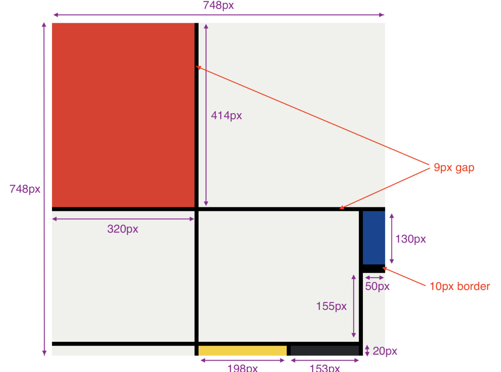

# 🟥​🟨​Mondrian-Style Layout Project  🟩​🟦​

## 📌 Description  
This project is a pixel-perfect recreation of a layout inspired by the Mondrian art style. The design was implemented using **HTML** and **CSS**, showcasing the use of **CSS Grid** to replicate a grid-based modern UI.

---
## 🔧​ Technologies Used  
- **HTML5** for semantic structure.  
- **CSS3** for grid-based styling.  

---

## 🎯 Features  
- Use of CSS Grid for layout structure.  
- Implementation of bold primary colors inspired by Mondrian.
- Clean and responsive design.

---

## 🖼️  design Reference  
Here’s a preview of the Mondrian-inspired layout:  

  

---

## The Final Result  
You can view it here:  [my Mondrian](https://littlefoxy1nk.github.io/MONDRIAN/)  
